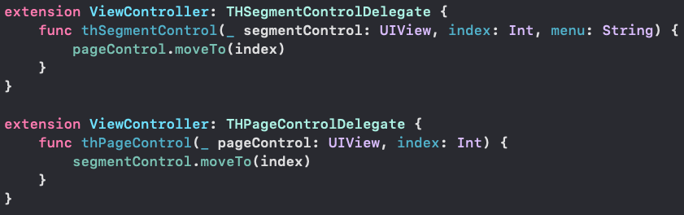
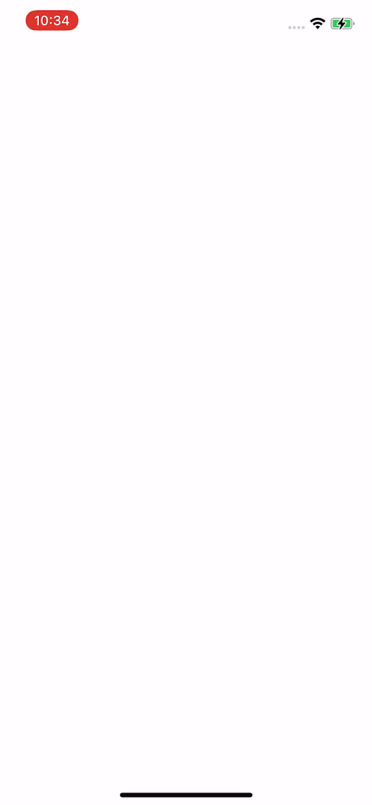

# THSegmentControl
#### Super Easy SegmentControl.

# Feature
- [x] pure swift 5.0 code

# Installation

#### CocoaPods
Simply add THSegmentControl to your `Podfile`.

```
pod 'THSegmentControl'
```
Enter command instruction into your terminal.

```
pod install
```

# Usage

You must create UIView and it use custom class in the storyboard after install THSegmentControl.

Then you must also import THSegmentControl, THPageControl and create a IBOutlet.


And write configure and make delegate methods with THSegmentControlDelegate, THPageControlDelegate.



You can see as below screen.



The following sample code for your reference.

```swift
import UIKit

class ViewController: UIViewController {
    
    @IBOutlet weak var segmentControl: THSegmentControl!
    @IBOutlet weak var pageControl: THPageControl!
    
    let name = ["first", "second", "third"]
    
    override func viewDidLoad() {
        super.viewDidLoad()
        
        configureSegmentUI()
        configurePageControlUI()
    }
    
    // configure THSegmentControl
    private func configureSegmentUI() {
        segmentControl.delegate = self
        segmentControl.font = UIFont.systemFont(ofSize: 16, weight: .heavy)
        segmentControl.lineHeight = 2.0
        
        segmentControl.animation = true
        segmentControl.configure(name)
    }
    
    // configure THPageControl
    private func configurePageControlUI() {
        let storyboard = UIStoryboard(name: "Main", bundle: .main)
        let firstVC = storyboard.instantiateViewController(withIdentifier: "FirstVC") as! FirstVC
        let secondVC = storyboard.instantiateViewController(withIdentifier: "SecondVC") as! SecondVC
        let thirdVC = storyboard.instantiateViewController(withIdentifier: "ThirdVC") as! ThirdVC
        
        pageControl.delegate = self
        pageControl.animation = true
        pageControl.scrolled = true
        pageControl.configure(self, items: [firstVC, secondVC, thirdVC])
    }
}

extension ViewController: THSegmentControlDelegate {
    func thSegmentControl(_ segmentControl: UIView, index: Int, menu: String) {
        pageControl.moveTo(index)
    }
}

extension ViewController: THPageControlDelegate {
    func thPageControl(_ pageControl: UIView, index: Int) {
        segmentControl.moveTo(index)
    }
}
```

# License

THSegmentControl is available under the MIT license. See the LICENSE file for more info.

