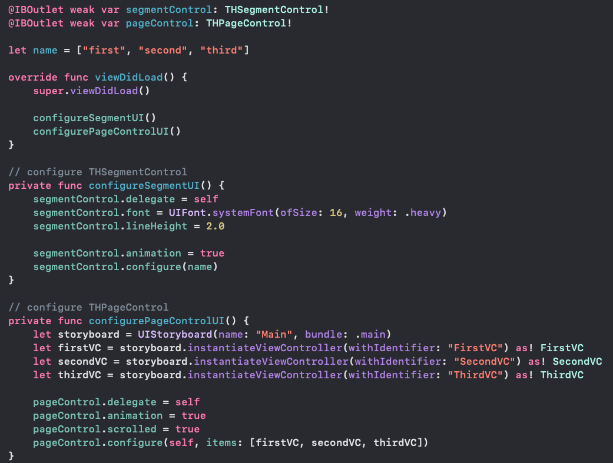

# THSegmentControl
#### Super Easy SegmentControl.

# Feature
- [x] pure swift 5.0 code

# Installation

#### CocoaPods
Simply add THSegmentControl to your `Podfile`.

```
pod 'THSegmentControl'
```
Enter command instruction into your terminal.

```
pod install
```

# Usage

You must create UIView and it use custom class in the storyboard after install THSegmentControl.


Then you must also import THSegmentControl and create a IBOutlet.



The following sample code for your reference.

```swift
import UIKit
import THSegmentControl

class ViewController: UIViewController {

    @IBOutlet weak var segmentControl: THSegmentControl!
    
    let menus = ["first", "second", "third"]
    
    override func viewDidLoad() {
        super.viewDidLoad()
        
        segmentControl.delegate = self
        segmentControl.font = UIFont.systemFont(ofSize: 16, weight: .heavy)
        segmentControl.lineHeight = 2.0
        segmentControl.configure(name)
    }
}
```

# License

THSegmentControl is available under the MIT license. See the LICENSE file for more info.

